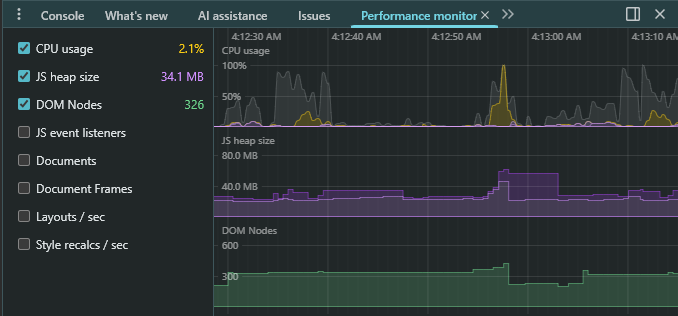

# Benchmark: Browser Memory Consumption

## Objective

Measure peak memory usage during proof generation and vote counting.

## Method

Measured using Google Chrome DevTools → Performance Monitor (JS Heap
Size).

## Environment

- CPU: Intel Core i7-10750H
- RAM: 16 GB

## Result Summary

- Peak JS Heap usage observed: \~34 MB

## Conclusion

Memory consumption remains significantly below the 500 MB requirement
threshold.
